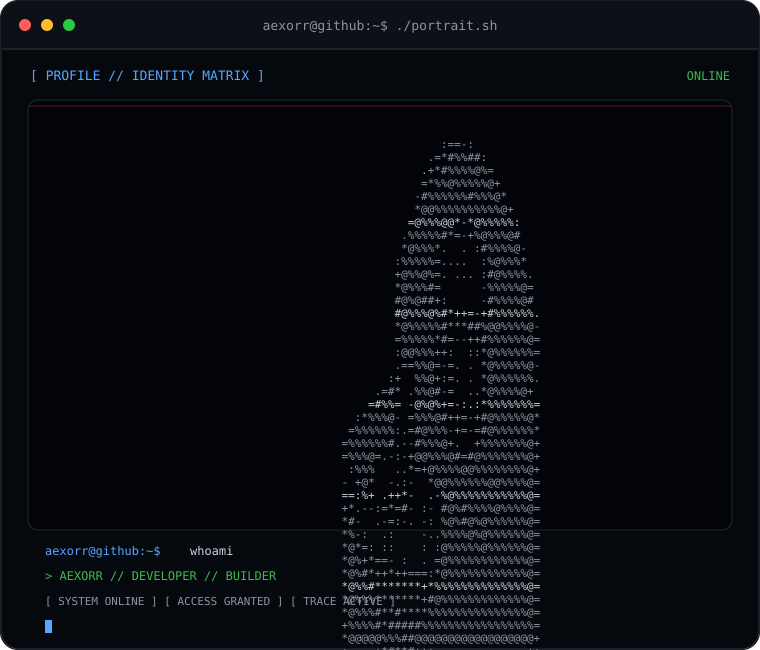
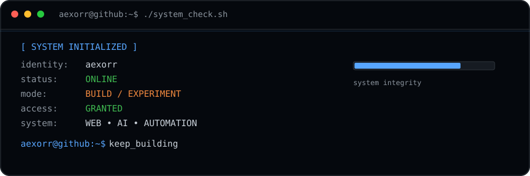
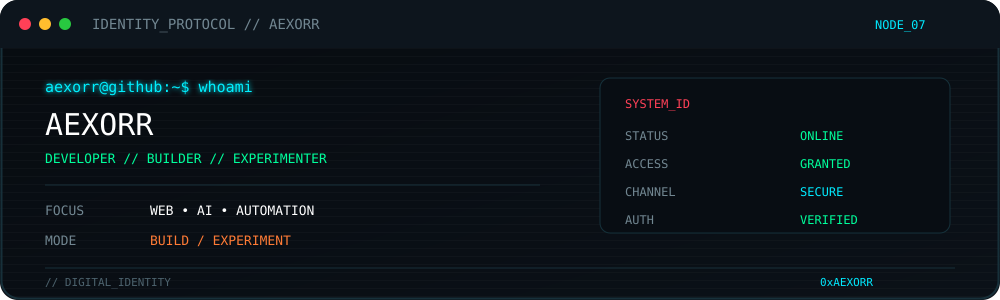

<!-- =============================== -->
<!--        AEXORR // SYSTEM         -->
<!-- =============================== -->

<div align="center">



<br/>

<div align="center">

</div>

<br/>

```text
┌──────────────────────────────────────────────────────────────────────┐
│                                                                      │
│   █████╗ ███████╗██╗  ██╗ ██████╗ ██████╗ ██████╗ ██████╗          │
│  ██╔══██╗██╔════╝╚██╗██╔╝██╔═══██╗██╔══██╗██╔══██╗██╔══██╗         │
│  ███████║█████╗   ╚███╔╝ ██║   ██║██████╔╝██████╔╝██████╔╝         │
│  ██╔══██║██╔══╝   ██╔██╗ ██║   ██║██╔══██╗██╔══██╗██╔══██╗         │
│  ██║  ██║███████╗██╔╝ ██╗╚██████╔╝██║  ██║██║  ██║██████╔╝         │
│  ╚═╝  ╚═╝╚══════╝╚═╝  ╚═╝ ╚═════╝ ╚═╝  ╚═╝╚═╝  ╚═╝╚═════╝          │
│                                                                      │
│                    [ SYSTEM ONLINE ]                                │
│                    [ ACCESS GRANTED ]                               │
│                                                                      │
└──────────────────────────────────────────────────────────────────────┘
<div align="center">
  
</div>
╭──────────────────────────────────────────────────────────────────────╮
│                                                                      │
│  USER        :: aexorr                                                │
│  STATUS      :: ONLINE                                                │
│  MODE        :: BUILD                                                 │
│  LOCATION    :: INDIA                                                 │
│                                                                      │
│  CURRENTLY   :: Building + Learning                                  │
│  FOCUS       :: Web • AI • Automation • Experiments                  │
│                                                                      │
╰──────────────────────────────────────────────────────────────────────╯
┌──────────────────────────────────────────────────────────────────────┐
│                                                                      │
│  LANGUAGES                                                           │
│  ├── Python                                                          │
│  ├── JavaScript                                                       │
│  └── C++                                                             │
│                                                                      │
│  WEB                                                                  │
│  ├── HTML                                                             │
│  ├── CSS                                                              │
│  ├── React                                                            │
│  └── Node.js                                                          │
│                                                                      │
│  TOOLS                                                                │
│  ├── Git                                                              │
│  ├── GitHub                                                           │
│  ├── VS Code                                                          │
│  └── APIs                                                             │
│                                                                      │
└──────────────────────────────────────────────────────────────────────┘
╔══════════════════════════════════════════════════════════════════════╗
║                         ACTIVE PROCESSES                             ║
╠══════════════════════════════════════════════════════════════════════╣
║                                                                      ║
║  [01] WEB PROJECTS                                      ████████░░   ║
║  [02] AI EXPERIMENTS                                    ██████░░░░   ║
║  [03] AUTOMATION                                       ███████░░░   ║
║  [04] CREATIVE BUILDS                                  █████████░   ║
║                                                                      ║
╚══════════════════════════════════════════════════════════════════════╝
┌──────────────────────────────────────────────────────────────────────┐
│ aexorr@github:~$ ./run.sh                                           │
│                                                                      │
│ [✓] Loading profile...                                               │
│ [✓] Loading projects...                                              │
│ [✓] Loading contribution matrix...                                   │
│ [✓] Initializing developer mode...                                   │
│                                                                      │
│ ████████████████████████████████████████████████████████ 100%       │
│                                                                      │
│ SYSTEM READY                                                         │
│                                                                      │
│ aexorr@github:~$ echo "keep building."                               │
│ keep building.                                                       │
│                                                                      │
└──────────────────────────────────────────────────────────────────────┘
```

---

<div align="center">

### `// BUILD • LEARN • BREAK • REBUILD`

```text
01000001 01000101 01011000 01001111 01010010 01010010
```

**`aexorr@github:~$ _`**

<br/>


</div>
